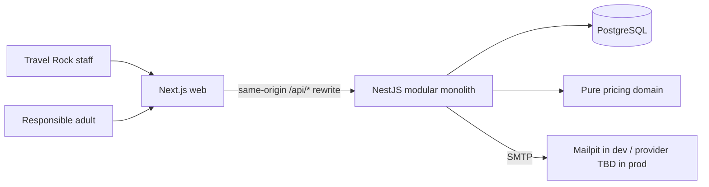

# Architecture — Travel Rock Commercial Platform

> Status: **Approved 2026-10-02 (Phase 0).** Target architecture, not a description of implemented software. Business rules live in `DOMAIN.md`; decision log in `MVP_PLAN.md`.

## System context



One web application with two separately authorized areas: `/admin/*` (staff) and the public onboarding/account area (applicants). NestJS is authoritative for authorization, commercial state, pricing and persistence.

## Monorepo layout (pnpm workspaces, Node ≥ 22.13, Node 24 LTS recommended)

```text
travel-rock-platform/
├── CLAUDE.md
├── docs/ (MVP_PLAN.md, ARCHITECTURE.md, DOMAIN.md)
├── apps/
│   ├── web/                       # Next.js App Router, RHF + Zod, Zustand, Tailwind
│   │   ├── src/app/(public)/...   # onboarding, ingresar, mis-viajes, privacidad
│   │   ├── src/app/(admin)/admin/...
│   │   └── e2e/                   # Playwright
│   └── api/                       # NestJS, Prisma, PostgreSQL
│       ├── prisma/schema.prisma
│       ├── prisma/migrations/     # includes hand-written SQL (see below)
│       └── src/modules/
│           ├── staff-auth/  staff-users/
│           ├── schools/  school-groups/  services/
│           ├── pricing/            # pure domain, no Nest/Prisma imports
│           ├── proposals/
│           ├── public-identity/    # applicants, contacts, OTP, applicant sessions
│           ├── public-catalog/     # limited school/group search
│           ├── enrollments/  school-requests/  dashboard/
│           └── mail/               # VerificationSender (SMTP adapter)
├── packages/shared/               # Zod transport schemas + enums only; never imports Prisma
├── docker-compose.yml             # postgres (dev :5440), postgres (test :5441), mailpit (:1025/:8025)
└── README.md
```

No Turborepo unless a need is demonstrated. The pricing engine stays in the API (server authority); the web only displays server results.

## API boundaries

- **Controllers**: HTTP, Zod DTO validation (shared schemas via a Zod validation pipe), guards, response mapping. Separate DTOs for staff and public responses; public endpoints never return staff DTOs.
- **Application services**: use cases and transaction orchestration (publish, clone, enrollment submission, OTP verification).
- **Domain**: pricing (`french-tna12-v1`), proposal lifecycle rules, matching/eligibility policy, normalization functions. Pure and unit-tested.
- **Infrastructure**: Prisma, SMTP adapter. No generic repositories or base controllers.

## Authentication and authorization

### Staff (T6 — sessions, explained 2026-10-02)
- **Server-side sessions** in PostgreSQL: random 256-bit opaque token in cookie `tr_staff`, stored as HMAC-SHA256 hash; `HttpOnly; Secure; SameSite=Lax; Path=/`. Proposed expiry: 2 h idle, 12 h absolute.
- Chosen over JWT because there is one API, one DB and browser-only clients: sessions give immediate logout/deactivation/role change without a denylist or refresh-token rotation; the per-request indexed lookup is negligible; CSRF handling is required either way with cookies. Revisit only if independent services or third-party API consumers appear (opaque tokens would still work for a mobile app).
- Passwords: argon2id (19 MiB, t=2, p=1), 12–128 characters, no composition rules, must differ from the email. Unknown emails still run one hash verification (no account enumeration by timing). No self-signup.
- Failed password checks (login and change-password) are counted per email+IP (5), per email (20) and per IP (50) in a 15-minute window by an in-memory limiter; a success clears only the email+IP counter. Failure-based rather than `@nestjs/throttler`, so legitimate repeated logins are never blocked.
- First ADMIN created by a CLI command (`pnpm staff:create-admin --email … --name …`), which prints a one-time server-generated temporary password and refuses once an active ADMIN exists. ADMIN creates users and resets passwords the same way (temporary password shown once, `mustChangePassword`), changes roles and deactivates. While `mustChangePassword` is set, only `me`, `logout` and `change-password` are reachable (`PASSWORD_CHANGE_REQUIRED`). No email-based reset in MVP.
- Lock-out protection: an ADMIN cannot change their own role, deactivate themselves or reset their own password; the last active ADMIN cannot be removed (active ADMIN rows locked `FOR UPDATE` in a fixed order, tested with concurrent requests).
- Revocation: logout deletes the session; deactivation and password reset delete all of the user's sessions; password change deletes all other sessions; login replaces any session presented (no fixation). Roles and active status are read from the database on every request.
- **Default-deny**: a global guard requires a staff session for every route; public routes opt out explicitly with `@Public()` and live under `/api/public/*`. `@Roles()` enforces the role matrix in `DOMAIN.md`. Next.js middleware redirects to login for UX only; it is never the security boundary.

### Applicants (T1, T8)
- Passwordless email OTP (see `DOMAIN.md` → Public identity). Separate `ApplicantSession` table, cookie `tr_public`, separate guard. Proposed expiry: 7 days idle, 30 days absolute.
- OTP codes and session tokens stored as HMAC-SHA256 with a server secret (`AUTH_HMAC_SECRET`); group access codes stored with argon2id.
- `VerificationSender` interface with an SMTP implementation. Dev/test: **Mailpit** container (local SMTP + web UI, nothing leaves the machine). Production provider is a deployment blocker. Codes are never logged.

### Cross-cutting
- **Same origin**: Next.js rewrites `/api/*` to NestJS, so the browser talks to one origin; no CORS-with-credentials. CSRF defense: SameSite=Lax + `Origin`/`Host` check on all mutating requests.
- Client IP comes from Express `trust proxy` (`TRUST_PROXY`, default `loopback` = the Next.js server). Next.js forwards a client-supplied `X-Forwarded-For` unchanged (verified 2026-10-02), so production must put the web server behind a proxy that overwrites it.
- Errors: every API error is `{ statusCode, code, message, issues? }` (`apiErrorSchema`), produced by a global filter; validation issues carry paths and messages, never input values; unexpected errors are logged by name only.
- Public rate limiting: a small in-memory fixed-window `RateLimiter` (Phase 9) instead of `@nestjs/throttler`, same single-instance limitation; OTP request: 60 s cooldown + 3/15 min per contact + 10/h per IP; verify: 30/15 min per IP and 5 attempts per challenge; public search: 60/min per applicant; enrollments: 20/h per applicant.
- Email: `VerificationSender` → SMTP via `nodemailer` (`SMTP_HOST`, `SMTP_PORT`, `SMTP_SECURE`, `SMTP_USER`, `SMTP_PASSWORD`, `MAIL_FROM`); Mailpit in dev/test.
- Rate limiting (earlier plan): `@nestjs/throttler`, in-memory store. **Limitation: single API instance**; horizontal scaling needs a shared store (Redis is out of MVP scope). Initial targets (tune later): OTP request 3/15 min per contact and 10/h per IP; 5 attempts per OTP challenge; staff login 5/15 min per email+IP; access code 5/15 min per applicant; public search 60/min per session.
- Honeypot: **not implemented** (the strict public schemas reject unknown fields); deferred together with CAPTCHA (owner decision). Found in Phase 14.
- Concurrency of the limits (Phase 14): every limiter counts an attempt synchronously **before** the slow or asynchronous check — OTP verification takes one of the challenge's 5 attempts with a conditional `UPDATE … WHERE attempts < 5` before comparing the code (even a right code counts one), and staff login/change-password reserve the failure before argon2 and refund it on success — so a concurrent burst cannot exceed a limit. `RateLimiter` keys expire with their own window, and at 50 000 live keys (100 000 for logins) new keys are refused (fail closed) rather than growing without bound or resetting other counters.
- Known limitation (accepted for the MVP, documented): 20 wrong passwords per 15 min against one email lock that account (including the last ADMIN) for the rest of the window, from any IP; recovery is waiting or restarting the API.
- Safe error responses (no stack traces, no existence leaks), pagination everywhere, no PII/credentials/codes in logs, secrets only in env vars.

## REST contract (proposed)

All routes under `/api`. Money fields are decimal strings of centavos. Lists are paginated (`page`, `pageSize ≤ 100`).

### Staff — `/api/admin/*`

| Method & path | Roles | Purpose |
|---|---|---|
| `POST /auth/login`, `POST /auth/logout`, `GET /auth/me`, `POST /auth/change-password` | any staff | Session |
| `GET/POST /users`, `PATCH /users/:id`, `POST /users/:id/temporary-password` | ADMIN | Staff users |
| `GET /schools?q&province&city&status&page&pageSize` · `POST /schools` · `GET/PATCH /schools/:id` | read: all · write: ADMIN, COMMERCIAL | Schools. `q` matches normalized name (contains or trigram word similarity ≥ 0.6, so typos match) or a CUE prefix; `city` likewise; `status` = `active` (default) / `inactive` / `all`. Deactivate with `PATCH {active:false}`; no delete. Detail will embed groups in Phase 4 |
| `GET /schools/duplicate-check?name&province&city&cue&excludeId` | ADMIN, COMMERCIAL | Soft duplicate warning: same CUE (first 7 digits), or same province + similar city (trigram ≥ 0.6) + similar name (trigram ≥ 0.6 or one name contained in the other, word similarity ≥ 0.9); max 5. Thresholds calibrated on sample names (Phase 3) |
| `GET /school-groups?schoolId&travelYear&status&q&page&pageSize` · `POST /school-groups` · `GET/PATCH /school-groups/:id` | read: all · write: ADMIN, COMMERCIAL | Groups (one create endpoint for both UI paths). `q` matches group or school name; `status` = `active` (default) / `inactive` / `all`; ordered by school, year, name. Each item embeds a school summary and `accessCode: {configured, rotatedAt}`. Unknown `schoolId` → 400 issue on `schoolId`; duplicate identity → `409 GROUP_TAKEN`; `PATCH` is strict (no `schoolId`). The school detail page lists its groups through this endpoint (`schoolId` filter) |
| `POST /school-groups/:id/access-code` | ADMIN, COMMERCIAL | Generate/rotate; returns `{ accessCode: "ABCD-EFGH", group }` once |
| `GET /services?q&category&status&page&pageSize` · `POST /services` · `GET/PATCH /services/:id` | read: all · write: ADMIN, COMMERCIAL | Catalog. `basePriceMinor` is a centavo string; `status` = `active` (default) / `inactive` / `all`; ordered by category, name; strict `PATCH` (no `pricingUnit`); deactivate with `PATCH {active:false}`, no delete |
| `GET /proposals?schoolGroupId&status` · `GET /proposals/:id` | all staff | Read |
| `POST /proposals` `{schoolGroupId}` | ADMIN, COMMERCIAL | Create v1 draft (409 if a draft exists) |
| `PUT /proposals/:id` | ADMIN, COMMERCIAL | Replace draft items + plan + validity atomically. Strict body `{items[{serviceId, quantity, unitPriceMinor?, discountMinor}], commercialDiscountMinor, downPaymentMinor, installments, tnaBps, validFrom?, validUntil?}`; recalculates and stores the snapshot; `409 PROPOSAL_READ_ONLY` unless DRAFT |
| `POST /proposals/:id/versions` | ADMIN, COMMERCIAL | Clone into next-version draft |
| `POST /proposals/:id/publish` `{expectedUpdatedAt?}` · `POST /proposals/:id/archive` | ADMIN, COMMERCIAL | Publish / discard draft or withdraw publication. Every write on a group's proposals runs in a transaction holding `SELECT … FOR UPDATE` on the group row; publish requires ≥ 1 item and a future `validUntil` (400 issues). Optimistic concurrency (Phase 14): `PUT` and publish accept the draft's `updatedAt` the editor saw; a stale one → 409 `PROPOSAL_CHANGED`, so nobody publishes prices they did not see (the builder always sends it) |
| `POST /pricing/preview` | ADMIN, COMMERCIAL | Calculate from inputs (no persistence). Strict body: `items[{quantity, unitPriceMinor, discountMinor}]`, `commercialDiscountMinor`, `downPaymentMinor`, `installments`, `tnaBps` — no totals accepted. Returns `pricingResultSchema` (all money as centavo strings, full schedule, `scheduleSummary`, TEA/CFT bps, `roundingPolicy`). Contract violations → 400 with field issues (e.g. `items.0.discountMinor`) |
| `GET /dashboard/summary?travelYear` | all staff | Counts only (no personal data): schools active/inactive; groups active/inactive/with access code; proposals draft / published current / published expired / published scheduled / archived; enrollments total / with access / without; requests pending / reviewing. `travelYear` filters groups, proposals, enrollments and requests. "Published current" means inside the validity window regardless of group status (what families can see additionally needs an active group and school) |
| `GET /school-groups/:id/plan-preferences` | all staff | Counts of families per payment option (0 = contado) of the group's current publication; no personal data (2026-10-03) |
| `GET /dashboard/analytics?period&travelYear` | all staff | Post-MVP analytics (owner request 2026-10-02). Aggregates only, no personal data: enrollments per day/ISO week/month in Argentina time (`period` = 30d/90d/12m) against the same-length previous period, funnel (enrolled → access code → opened a proposal), enrollments by province and top schools, proposals expiring within 30 days, groups per travel year, min/median/max per-passenger cash and financed price of currently visible proposals (`percentile_disc`, exact centavos), requests by status/type and most requested schools. |
| `GET /school-requests?type&status&q&page` · `GET /school-requests/:id` · `PATCH /school-requests/:id` `{status?, staffNotes?}` | read: all (contact only for ADMIN/COMMERCIAL) · update: ADMIN, COMMERCIAL | Triage queue; `status` = `open` (default: PENDING + REVIEWING) / one status / `all`; each item carries `openRequestsForSchool` (demand) |

### Public — `/api/public/*`

| Method & path | Auth | Purpose |
|---|---|---|
| `POST /auth/otp/request` `{type, value}` | none | Always 202 + opaque `challengeId` |
| `POST /auth/otp/verify` `{challengeId, code, fullName?}` | none | Sign in or create applicant; sets `tr_public` |
| `POST /auth/logout`, `GET /me` | applicant | Session / profile |
| `POST /me/contacts` (202 `{challengeId}`) · `POST /me/contacts/verify` `{challengeId, code}` · `DELETE /me/contacts/:id` | applicant | Change email: the new address is added only once verified; removing the last verified contact → `409 LAST_CONTACT`; an address verified by someone else → `409 CONTACT_TAKEN` |
| `GET /schools?q&province&city` | applicant | Active schools: id, name, city, province only; min 3 chars for `q` |
| `GET /schools/:id/groups?travelYear` | applicant | Active groups: id, name, travelYear only |
| `POST /enrollments` | applicant | Atomic submission (idempotency key): 201 created, 200 for a retry or for the same student already registered (`alreadyRegistered`); returns `{enrollment, alreadyRegistered}`. Phase 10 adds the access-code result states |
| `GET /enrollments` · `POST /enrollments/:id/access-code` `{code}` | applicant (own) | List with `offerState` / enter code later (`INVALID_ACCESS_CODE`, 429 after 5 attempts) |
| `GET /enrollments/:id/proposal` | applicant (own) | `{state: 'CODE_REQUIRED'}`, `{state: 'PREPARING'}` or `{state: 'AVAILABLE', proposal, preferredInstallments}` (current eligible publication; records `ProposalView`); other applicants' enrollments → 404 |
| `PUT /enrollments/:id/preference` | applicant (own) | `{installments}` (0 = contado or one of the current publication's options): expression of interest only, 30 / 15 min per applicant; no offer available → 409 `OFFER_NOT_AVAILABLE` (2026-10-03) |
| `POST /school-requests` | applicant | `SCHOOL_NOT_FOUND` `{schoolName, province, city, course, travelYear}` / `GROUP_NOT_FOUND` `{schoolId, course, travelYear}`; always 202 with the same neutral message; per-applicant dedup while open (partial unique index) |

## Data and integrity

- PostgreSQL 17 + Prisma. IDs: **UUIDv7** generated by Prisma (`uuid(7)`), native `uuid` column type (T3). Verify `uuid(7)` support in the installed Prisma version at bootstrap.
- Money: `BIGINT` ↔ Prisma `BigInt` ↔ JS `bigint`; explicit JSON serialization as strings (`JSON.stringify` throws on `bigint`). Rates: `Int` bps (T2).
- Things Prisma's schema language cannot express are written as **hand-edited SQL migrations** (`prisma migrate dev --create-only`) (T5). Every later generated migration must be reviewed so it does not drop them, and an integration test asserts they exist.

### Prisma schema proposal

```prisma
enum StaffRole        { ADMIN COMMERCIAL VIEWER }
enum SchoolGroupStatus { ACTIVE INACTIVE }
enum ServiceCategory  { TRANSPORT LODGING MEALS EXCURSIONS INSURANCE OTHER } // accepted 2026-10-02
enum PricingUnit      { PER_PASSENGER }
enum ProposalStatus   { DRAFT PUBLISHED ARCHIVED }
enum ContactType      { EMAIL PHONE }
enum Relationship     { GUARDIAN ADULT_STUDENT }
enum EnrollmentStatus { SUBMITTED WITHDRAWN }
enum RequestType      { SCHOOL_NOT_FOUND GROUP_NOT_FOUND }
enum RequestStatus    { PENDING REVIEWING RESOLVED DISMISSED }
enum Province {
  BUENOS_AIRES CABA CATAMARCA CHACO CHUBUT CORDOBA CORRIENTES ENTRE_RIOS FORMOSA JUJUY
  LA_PAMPA LA_RIOJA MENDOZA MISIONES NEUQUEN RIO_NEGRO SALTA SAN_JUAN SAN_LUIS SANTA_CRUZ
  SANTA_FE SANTIAGO_DEL_ESTERO TIERRA_DEL_FUEGO TUCUMAN
}

model StaffUser {
  id                 String    @id @default(uuid(7)) @db.Uuid
  email              String    @unique            // normalized lowercase
  fullName           String
  passwordHash       String
  role               StaffRole
  active             Boolean   @default(true)
  mustChangePassword Boolean   @default(false)
  createdAt          DateTime  @default(now())
  updatedAt          DateTime  @updatedAt
  sessions           StaffSession[]
  createdProposals   CommercialProposal[] @relation("ProposalCreatedBy")
  publishedProposals CommercialProposal[] @relation("ProposalPublishedBy")
  resolvedRequests   SchoolRequest[]
}

model StaffSession {
  id          String    @id @default(uuid(7)) @db.Uuid
  tokenHash   String    @unique
  staffUserId String    @db.Uuid
  staffUser   StaffUser @relation(fields: [staffUserId], references: [id], onDelete: Cascade)
  createdAt   DateTime  @default(now())
  lastSeenAt  DateTime  @default(now())
  expiresAt   DateTime
  @@index([staffUserId])
}

model School {
  id             String   @id @default(uuid(7)) @db.Uuid
  name           String
  normalizedName String
  province       Province
  city           String
  normalizedCity String
  address        String?
  cue            String?  @unique
  active         Boolean  @default(true)
  createdAt      DateTime @default(now())
  updatedAt      DateTime @updatedAt
  groups         SchoolGroup[]
  requests       SchoolRequest[]
  @@index([province, normalizedCity])
}

model SchoolGroup {
  id                  String            @id @default(uuid(7)) @db.Uuid
  schoolId            String            @db.Uuid
  school              School            @relation(fields: [schoolId], references: [id], onDelete: Restrict)
  name                String
  normalizedName      String
  travelYear          Int
  estimatedStudents   Int?
  status              SchoolGroupStatus @default(ACTIVE)
  accessCodeHash      String?
  accessCodeRotatedAt DateTime?
  createdAt           DateTime          @default(now())
  updatedAt           DateTime          @updatedAt
  proposals           CommercialProposal[]
  enrollments         Enrollment[]
  @@unique([schoolId, normalizedName, travelYear])
  @@index([travelYear, status])
}

model Service {
  id             String          @id @default(uuid(7)) @db.Uuid
  name           String
  normalizedName String
  description    String?
  category       ServiceCategory
  pricingUnit    PricingUnit     @default(PER_PASSENGER)
  basePriceMinor BigInt
  active         Boolean         @default(true)
  createdAt      DateTime        @default(now())
  updatedAt      DateTime        @updatedAt
  items          ProposalItem[]
  @@index([active, category])
}

model CommercialProposal {
  id                String         @id @default(uuid(7)) @db.Uuid
  schoolGroupId     String         @db.Uuid
  schoolGroup       SchoolGroup    @relation(fields: [schoolGroupId], references: [id], onDelete: Restrict)
  version           Int
  status            ProposalStatus @default(DRAFT)
  clonedFromId      String?        @db.Uuid
  clonedFrom        CommercialProposal?  @relation("ProposalClone", fields: [clonedFromId], references: [id], onDelete: Restrict)
  clones            CommercialProposal[] @relation("ProposalClone")
  validFrom         DateTime?
  validUntil        DateTime?      // required at publish
  createdById       String         @db.Uuid
  createdBy         StaffUser      @relation("ProposalCreatedBy", fields: [createdById], references: [id], onDelete: Restrict)
  publishedById     String?        @db.Uuid
  publishedBy       StaffUser?     @relation("ProposalPublishedBy", fields: [publishedById], references: [id], onDelete: Restrict)
  publishedAt       DateTime?
  archivedAt        DateTime?
  cashPriceMinor    BigInt?        // summary columns, from snapshot
  totalPayableMinor BigInt?
  createdAt         DateTime       @default(now())
  updatedAt         DateTime       @updatedAt
  items             ProposalItem[]
  paymentPlan       PaymentPlan?
  views             ProposalView[]
  @@unique([schoolGroupId, version])
  @@index([status])
}

model ProposalItem {
  id                      String             @id @default(uuid(7)) @db.Uuid
  proposalId              String             @db.Uuid
  proposal                CommercialProposal @relation(fields: [proposalId], references: [id], onDelete: Restrict)
  serviceId               String             @db.Uuid
  service                 Service            @relation(fields: [serviceId], references: [id], onDelete: Restrict)
  position                Int
  serviceNameSnapshot     String
  serviceCategorySnapshot ServiceCategory
  pricingUnitSnapshot     PricingUnit
  catalogUnitPriceMinor   BigInt
  unitPriceMinor          BigInt
  quantity                Int
  discountMinor           BigInt             @default(0)
  @@unique([proposalId, position])
}

model PaymentPlan {
  id                      String             @id @default(uuid(7)) @db.Uuid
  proposalId              String             @unique @db.Uuid
  proposal                CommercialProposal @relation(fields: [proposalId], references: [id], onDelete: Restrict)
  commercialDiscountMinor BigInt             @default(0)
  downPaymentMinor        BigInt             @default(0)
  installments            Int
  tnaBps                  Int
  pricingSnapshot         Json?              // JSONB; frozen at publish
}

model Applicant {
  id          String   @id @default(uuid(7)) @db.Uuid
  fullName    String
  createdAt   DateTime @default(now())
  updatedAt   DateTime @updatedAt
  contacts    ApplicantContact[]
  sessions    ApplicantSession[]
  enrollments Enrollment[]
  requests    SchoolRequest[]
}

model ApplicantContact {
  id              String      @id @default(uuid(7)) @db.Uuid
  applicantId     String      @db.Uuid
  applicant       Applicant   @relation(fields: [applicantId], references: [id], onDelete: Cascade)
  type            ContactType
  valueNormalized String
  verifiedAt      DateTime?
  createdAt       DateTime    @default(now())
  @@index([applicantId])
  @@index([type, valueNormalized])
}

model OtpChallenge {
  id              String      @id @default(uuid(7)) @db.Uuid
  type            ContactType
  valueNormalized String
  applicantId     String?     @db.Uuid   // set when an existing applicant adds a contact
  codeHash        String
  attempts        Int         @default(0)
  expiresAt       DateTime
  consumedAt      DateTime?
  createdAt       DateTime    @default(now())
  @@index([type, valueNormalized, createdAt])
}

model ApplicantSession {
  id          String    @id @default(uuid(7)) @db.Uuid
  tokenHash   String    @unique
  applicantId String    @db.Uuid
  applicant   Applicant @relation(fields: [applicantId], references: [id], onDelete: Cascade)
  createdAt   DateTime  @default(now())
  lastSeenAt  DateTime  @default(now())
  expiresAt   DateTime
  @@index([applicantId])
}

model Enrollment {
  id                    String           @id @default(uuid(7)) @db.Uuid
  applicantId           String           @db.Uuid
  applicant             Applicant        @relation(fields: [applicantId], references: [id], onDelete: Restrict)
  schoolGroupId         String           @db.Uuid
  schoolGroup           SchoolGroup      @relation(fields: [schoolGroupId], references: [id], onDelete: Restrict)
  studentFirstName      String
  studentLastName       String
  studentNormalizedName String
  relationship          Relationship
  consentTextVersion    String
  consentedAt           DateTime
  accessGrantedAt       DateTime?
  idempotencyKey        String           @unique @db.Uuid
  status                EnrollmentStatus @default(SUBMITTED)
  createdAt             DateTime         @default(now())
  updatedAt             DateTime         @updatedAt
  views                 ProposalView[]
  @@unique([applicantId, schoolGroupId, studentNormalizedName])
  @@index([schoolGroupId, status])
}

model ProposalView {
  enrollmentId  String             @db.Uuid
  enrollment    Enrollment         @relation(fields: [enrollmentId], references: [id], onDelete: Cascade)
  proposalId    String             @db.Uuid
  proposal      CommercialProposal @relation(fields: [proposalId], references: [id], onDelete: Restrict)
  firstViewedAt DateTime           @default(now())
  @@id([enrollmentId, proposalId])
}

model SchoolRequest {
  id             String        @id @default(uuid(7)) @db.Uuid
  type           RequestType
  applicantId    String        @db.Uuid
  applicant      Applicant     @relation(fields: [applicantId], references: [id], onDelete: Restrict)
  schoolId       String?       @db.Uuid   // required for GROUP_NOT_FOUND (CHECK)
  school         School?       @relation(fields: [schoolId], references: [id], onDelete: Restrict)
  schoolName     String
  province       Province
  city           String
  course         String
  travelYear     Int
  status         RequestStatus @default(PENDING)
  dedupKey       String
  staffNotes     String?
  resolvedById   String?       @db.Uuid
  resolvedBy     StaffUser?    @relation(fields: [resolvedById], references: [id], onDelete: Restrict)
  createdAt      DateTime      @default(now())
  updatedAt      DateTime      @updatedAt
  @@index([type, status, createdAt])
}
```

### Hand-written SQL migrations

| Object | Purpose |
|---|---|
| `CREATE EXTENSION pg_trgm` (hand-written) + GIN trigram indexes on `School.normalizedName`, `School.normalizedCity`, `Service.normalizedName` (declared in `schema.prisma` with `type: Gin`, so they are not drift) | Fuzzy search (T9) |
| `UNIQUE (schoolGroupId) WHERE status = 'PUBLISHED'` | One current publication per group (done; Prisma 7 ignores partial indexes in its drift check, verified) |
| `UNIQUE (schoolGroupId) WHERE status = 'DRAFT'` | One draft per group (done) |
| `UNIQUE (type, valueNormalized) WHERE verifiedAt IS NOT NULL` on `ApplicantContact` | Verified contact owned by one applicant |
| `UNIQUE (dedupKey) WHERE status IN ('PENDING','REVIEWING')` on `SchoolRequest` | Request dedup (done) |
| Triggers on `ProposalItem` and `PaymentPlan` | Reject INSERT/UPDATE/DELETE unless parent proposal is DRAFT (done) |
| Trigger on `CommercialProposal` | When OLD.status ≠ DRAFT, only allow PUBLISHED → ARCHIVED (+ `archivedAt`, `updatedAt`); non-DRAFT rows cannot be deleted (done) |
| CHECK constraints | `StaffUser.email` normalized; `School.cue` 7 or 9 digits; `School.normalizedName/normalizedCity` in normalized form; `SchoolGroup`: `estimatedStudents > 0`, `travelYear` 2000–2100, normalized name, access code hash/date consistency; `Service`: `basePriceMinor` 0–10^14, normalized name (done); amounts ≥ 0; `quantity BETWEEN 1 AND 999`; `installments BETWEEN 0 AND 36`; `tnaBps BETWEEN 0 AND 6600`; `estimatedStudents > 0`; `version ≥ 1`; `SchoolRequest`: `type = 'GROUP_NOT_FOUND'` ⇔ `schoolId IS NOT NULL` |

The "at least one verified contact" invariant is enforced in the application (transaction + row lock on `Applicant`), not in SQL.

## Money and calculation design

Formula `french-tna12-v1`, limits, rounding and reference vectors are specified in `DOMAIN.md` → Pricing contract. The engine is a pure TypeScript module over `bigint` with no floating point. The admin preview calls `POST /api/admin/pricing/preview`; save and publish recalculate from persisted inputs and reject inconsistent requests. Public display labels rates exactly as TNA, TEA and CFT, with `CFT = TEA` only while `cftIncludesCosts = false`.

## Frontend routes

```text
/admin/login                       /onboarding            (multi-step, Zustand + sessionStorage, cleared on submit — T10)
/admin                             /ingresar              (OTP, returning applicants)
/admin/users                       /mis-viajes            (own enrollments, enter access code)
/admin/schools[/new|/[id]|/[id]/edit]   /mis-viajes/[enrollmentId] (AVAILABLE / PREPARING / CODE_REQUIRED)
/admin/groups[/new|/[id]|/[id]/edit]
/admin/services
/admin/proposals[/[id]]   (created from the group page; [id] = builder for drafts, read-only otherwise)
/admin/school-requests
```

UI copy is Spanish (es-AR); URL language may be revisited with the owner. School creation leads to its detail page, where `+ Crear grupo` preselects the school.

## Testing strategy

- **Unit (Vitest)**: pricing reference vectors from `DOMAIN.md` + property-based invariants, validation limits, normalization (names, emails, AR phones), lifecycle transitions, eligibility/matching policy.
- **Integration (real PostgreSQL test DB)**: constraints and hand-written SQL exist and work, publish transaction, **concurrent publish and concurrent clone** (exactly one wins), immutability triggers, OTP lifecycle (expiry, attempts, neutral responses), verified-contact uniqueness, contact change keeping ≥ 1 verified, idempotent enrollment, request dedup, role guard matrix, default-deny of new routes.
- **E2E (Playwright)**: set up in Phase 1 with a smoke test (web loads, API health through the `/api` rewrite, DB reachable), desktop and mobile Chromium, on dedicated ports (web 3100, API 3101) against the test DB. Business journeys A/B/C and the negative cases in Phase 13 (`apps/web/e2e/journeys/`, own config `playwright.journeys.config.ts`): serial, on a test DB emptied down to the initial ADMIN, reading OTP emails from the Mailpit API; staff on desktop and families on a phone context in the same test.
- **Security headers (Phase 14)**: API — `Content-Security-Policy: default-src 'none'; frame-ancestors 'none'`, `X-Frame-Options: DENY`, `nosniff`, `Referrer-Policy: no-referrer`, `Cache-Control: no-store`, HSTS (`common/security-headers.ts`). Web — `next.config.ts` `headers()` with `frame-ancestors 'none'`, `X-Frame-Options`, `nosniff`, `Referrer-Policy: same-origin`, `Permissions-Policy`, HSTS; `script-src` is not restricted yet (Next.js inline scripts need nonces — post-MVP).
- **Expired-data purge (Phase 14)**: `maintenance/expired-data.purger.ts` runs hourly in-process and deletes OTP challenges one day after expiry (they hold emails of people who may never sign up) and staff/applicant sessions past their idle or absolute expiry. Retention of applicants, enrollments and requests is still a legal decision (production blocker).
- **Database errors**: services map expected Prisma errors (P2002 → specific 409s, P2025 → 404); the global filter maps any unmapped P2025/P2002/P2003/P2034/P2000/P2023/P2033 to 404/409 `CONFLICT`/400 without internals, and everything else to a generic 500 that logs the error name only.
- **Environment**: `NODE_ENV` is required (no default), and in production any `dev-only…`/`test-only…` `AUTH_HMAC_SECRET` is rejected.
- **Known low-risk limitations (Phase 14 review, accepted for the MVP)**:
  - Access-code rotation: a code checked during its (argon2) verification while staff rotates it can still be accepted once; two simultaneous rotations each show a code and only the last one is valid.
  - Proposal items: the client sends the unit price it saw when adding the service; if the catalog price changed before saving, the line is stored as an override at the old price (shown as "Modificado" in the builder).
  - Snapshot reader: `formulaVersion` is the versioned union `french-tna12-v1 | french-tna12-v2` (2026-10-03, per-group lines); a further formula must extend it the same way so historical snapshots stay readable.
  - Indexes: foreign keys used only for joins/audit (`ProposalItem.serviceId`, `CommercialProposal.createdById/publishedById/clonedFromId`, `SchoolRequest.applicantId/schoolId/resolvedById`, `ProposalView.proposalId`) and `contains` filters on group names are unindexed; fine at MVP volumes, revisit with real data.
- **CI gates**: typecheck, lint, unit + integration tests, production builds, `prisma migrate diff` check against migrations, E2E.

## Architecture decision records

| ID | Decision | Status |
|---|---|---|
| ADR-01 | Modular monolith: Next.js 16 + NestJS 12 (ESM) + Prisma 7 (`pg` driver adapter) + PostgreSQL 17, pnpm workspaces, Node ≥ 22.13 (24 LTS recommended). API built with `tsc`/`tsc-watch` instead of the Nest CLI (its schematics dependency needs Node ≥ 22.22.3). TypeScript 6 and ESLint 9 pinned until typescript-eslint and the Next ESLint plugins support newer majors | Accepted; toolchain details recorded 2026-10-02 (Phase 1) |
| ADR-02 | Separate `StaffUser` and `Applicant` identities; applicant identified by opaque UUID with ≥ 1 verified contact (T1) | Accepted 2026-10-02 |
| ADR-03 | Money as `bigint` centavos end-to-end, strings over JSON, rates in bps (T2) | Accepted 2026-10-02 |
| ADR-04 | UUIDv7 primary keys, native `uuid` type (T3) | Accepted 2026-10-02 |
| ADR-05 | One row per proposal version; one PUBLISHED + one DRAFT per group via partial unique indexes; group row lock on publish/clone; immutability triggers (T4) | Accepted 2026-10-02 |
| ADR-06 | Hand-written SQL migrations for partial indexes, triggers, CHECKs, `pg_trgm`, verified by tests (T5) | Accepted 2026-10-02 |
| ADR-07 | Server-side sessions (staff and applicant) instead of JWT; same-origin rewrite; default-deny guard (T6) | Accepted 2026-10-02 |
| ADR-08 | Zod schemas shared via `packages/shared`; Zod pipe in Nest (T7) | Accepted 2026-10-02 |
| ADR-09 | In-memory throttling, idempotency keys, dedup keys; CAPTCHA and honeypot deferred (T8). Staff login uses a failure-based limiter (Phase 2), reserving each attempt before the hash check (Phase 14) | Accepted 2026-10-02 |
| ADR-10 | App-side normalization + `pg_trgm`; search by name, city, province (T9) | Accepted 2026-10-02 |
| ADR-11 | Onboarding draft in Zustand persisted to `sessionStorage` (T10) | Accepted 2026-10-02 |
| ADR-12 | Postgres (dev + test) and Mailpit in Docker Compose; Playwright configured in Phase 1 with a smoke test (T11) | Accepted 2026-10-02 |
| ADR-13 | French amortization, monthly rate TNA/12, fixed nominal installments, CFT = TEA while no costs (B2, B3, F-a, F-b) | Accepted 2026-10-02 |
| ADR-14 | Email OTP verification in MVP via `VerificationSender`; phone modeled, enabled later (F-e) | Accepted 2026-10-02 — scope change |
| ADR-15 | Group access code (hashed, shown once, rotatable) gates `AVAILABLE` (B7) | Accepted 2026-10-02 |

## Open items (non-blocking for Phase 1)

- Rate-limit values (tune in Phase 14).
- Deployment platform and monitoring (needed before Phase 14).
- Installment due dates (future, F-d).
- Staff access to enrollment contact lists (MVP shows counts only).
- Production blockers listed in `DOMAIN.md`.
