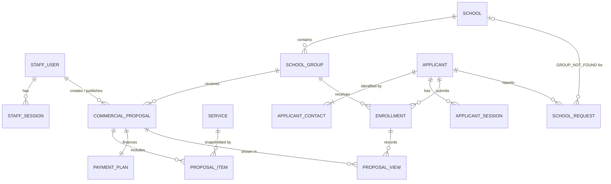
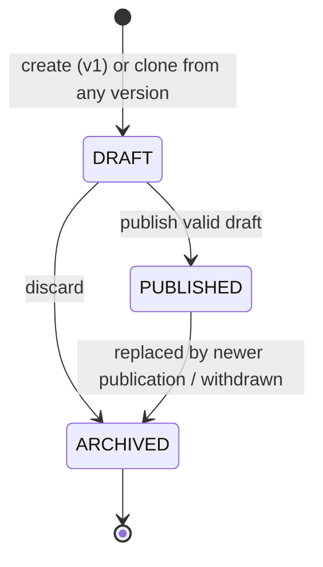

# Domain model — Travel Rock Commercial Platform

> Status: **Approved 2026-10-02 (Phase 0).** Decisions are referenced by ID (B1–B14, T1–T11, F-a…F-f) and listed in the decision log in `MVP_PLAN.md`. Legal/financial validation is still required before production (see "Production blockers").

## Ubiquitous language

- **School**: canonical educational institution created/managed by staff.
- **SchoolGroup**: one commercial cohort at one school (e.g., "5° A", trip year 2028). A school has many groups; every group has exactly one school.
- **Service**: reusable catalog entry; its current price is a default, never a historical quote.
- **CommercialProposal**: one immutable-once-published version of an offer for exactly one group, with its items and one payment plan.
- **ProposalItem**: a frozen selection of a service: snapshot of name/category/unit, catalog price, applied unit price, quantity and line discount.
- **PaymentPlan**: the financing inputs of a proposal version plus its calculated pricing snapshot.
- **StaffUser**: Travel Rock employee with a role (ADMIN, COMMERCIAL, VIEWER). Never a public user.
- **Applicant**: a public user (responsible adult: guardian or adult student). Identified by an opaque internal ID, never by email or phone.
- **ApplicantContact**: an email or phone belonging to an applicant; may be verified.
- **Group access code**: a short code staff hand out to a group; proves the applicant belongs to that group.
- **Enrollment**: noncontractual expression of interest of an applicant, for one student, in one group.
- **SchoolRequest**: a categorized help request (`SCHOOL_NOT_FOUND` or `GROUP_NOT_FOUND`) awaiting staff triage; never an automatically created School or SchoolGroup.

## ERD (conceptual)

Field-level detail and constraints live in the Prisma schema proposal in `ARCHITECTURE.md`.



`OtpChallenge` is intentionally not linked to an `Applicant` until the code is verified (see "Public identity"), so unverified sign-up attempts never create applicant rows.

## Entities and invariants

### School (B10)
`name, normalizedName, province, city, normalizedCity, address?, cue?, active`.
- `province` is one of the 24 Argentine jurisdictions (23 provinces + CABA), fixed enum.
- `cue` (Clave Única de Establecimiento) is optional and unique when present.
- **No hard uniqueness** on name/city: same-named campuses may coexist. On create/edit, staff see a soft duplicate warning (same normalized name + province + city, or fuzzy match).
- Normalization: lowercase, diacritics removed, whitespace collapsed (`"San Martín "` → `"san martin"`).
- Searchable by name, city and province, combinable (T9). Never hard-deleted once it has groups; deactivate instead. Inactive schools are hidden from public search.

### SchoolGroup (B9)
`schoolId, name, normalizedName, travelYear, estimatedStudents?, status (ACTIVE | INACTIVE), accessCodeHash?, accessCodeRotatedAt?`.
- `schoolId` required, FK-enforced, delete restricted. **Immutable after creation** (proposals and enrollments belong to the group): `PATCH` rejects `schoolId` (Phase 4 default).
- New groups cannot be created under an inactive school (`409 SCHOOL_INACTIVE`); existing groups of a deactivated school stay editable (Phase 4 default).
- `travelYear` = **calendar year in which the trip takes place** (not graduation year). Valid range: current year − 1 to current year + 5, checked only when the year is set or changed, so older groups stay editable (DB CHECK only enforces 2000–2100).
- **Unique `(schoolId, normalizedName, travelYear)`** enforced in DB. Staff disambiguate parallel groups by label (e.g., "5° A – Turno tarde").
- `estimatedStudents` positive if present; informational only, **never used as a pricing multiplier** (B1).
- Group status is operational and independent of proposal lifecycle. Inactive groups are hidden from public selection and from the admin list by default.
- Creatable from school detail (school preselected) or from the global group list (searchable school selector). Both use the same API endpoint.

### Group access code (B7)
- Generated by ADMIN/COMMERCIAL per group: 8 characters from the 31-symbol alphabet `ABCDEFGHJKMNPQRSTUVWXYZ23456789` (no `0/O/1/I/L`; ~40 bits), displayed as `ABCD-EFGH`. User input is normalized (uppercase, separators removed) before hashing/verification.
- Hash: argon2id with the password parameters; DB CHECK keeps `accessCodeHash` and `accessCodeRotatedAt` both set or both null. Staff (all roles) see only whether a code is configured and when it was generated.
- Stored only as a hash. **The plaintext is shown once at generation**; if staff lose it they rotate (generate a new one). Rotation invalidates the old code for new entries only.
- Verified against the specific group the applicant selected; attempts are rate-limited per applicant and per IP.
- A successful entry sets `Enrollment.accessGrantedAt`; access persists across later code rotations.
- Phase 10: the code can be given optionally at submission (a wrong code creates nothing) or later from "Mis viajes"; a wrong code and a group without a code get the **same** answer (`INVALID_ACCESS_CODE`, same hash cost); 5 attempts per 15 min per applicant (+ 20 per IP); a code of another group never opens this one.

### Service (B1, B13)
`name, normalizedName, description?, category, pricingUnit, basePriceMinor, active`.
- `pricingUnit` is `PER_PASSENGER` or `PER_GROUP` (post-MVP, **approved by the owner 2026-10-03**): a per-group price is the cost for the whole group, divided among each proposal's passenger count (see Pricing contract → Per-group lines). Chosen when the service is created; it cannot be changed afterwards.
- `category`: proposed enum `TRANSPORT | LODGING | MEALS | EXCURSIONS | INSURANCE | OTHER` (accepted 2026-10-02).
- `basePriceMinor` is the default unit price in centavos (per passenger, or for the whole group when `PER_GROUP`), 0–10^14 (0 = included at no charge; DB CHECK); editing it never changes existing proposal items.
- **Name unique across the catalog**, ignoring accents and case (`normalizedName` unique; `409 SERVICE_NAME_TAKEN`) — Phase 5 default, so services cannot be confused in the Proposal Builder. `pricingUnit` cannot be changed through the API.
- Staff type prices in Argentine format (`1.250.000,50`); `parseArsToMinor` converts exactly to centavos ("." thousands only, "," up to 2 decimals) and `formatArs` displays them — no floating point.
- Deactivated services remain referenced by historical items and cannot be added to new drafts.

### CommercialProposal (T4, B12)
`schoolGroupId, version, status (DRAFT | PUBLISHED | ARCHIVED), clonedFromId?, validFrom?, validUntil?, createdById, publishedById?, publishedAt?, archivedAt?, summary columns`.
- Unique `(schoolGroupId, version)`; version numbers assigned as `max + 1` under a group row lock.
- **At most one PUBLISHED** and **at most one DRAFT** per group (partial unique indexes).
- `validUntil` is optional while drafting and **required to publish**; must be in the future and ≥ `validFrom` when present. In the Proposal Builder validity is chosen as Argentine calendar days (UTC−3, no DST): `validFrom` = 00:00 and `validUntil` = 23:59:59.999 of the chosen day.
- PUBLISHED and ARCHIVED versions are read-only (application guard + DB trigger). The only allowed change to a PUBLISHED row is the transition to ARCHIVED.
- A draft is edited by replacing all its items and payment plan atomically (`PUT`). Invalid drafts cannot be saved (400 with field issues); every save recalculates the snapshot.
- Phase 7 defaults (owner informed): **one line per service** in a proposal; publication requires the group and the school to be active (`409 GROUP_INACTIVE` / `SCHOOL_INACTIVE`); new drafts continue the group's version numbering after archived versions.
- **Eligible** = `status = PUBLISHED` ∧ (`validFrom` is null ∨ `validFrom ≤ now`) ∧ `validUntil > now` ∧ group ACTIVE ∧ school active. An expired publication is not eligible (applicant sees `PREPARING`; dashboard flags it).

### ProposalItem (B6, B13)
`proposalId, serviceId, serviceNameSnapshot, serviceCategorySnapshot, pricingUnitSnapshot, catalogUnitPriceMinor, unitPriceMinor, quantity, discountMinor, position`.
- Every item of a proposal is included in the price (no `included` flag in MVP). Family-selectable optional extras are a future feature.
- `catalogUnitPriceMinor` is copied from the service at selection time; `unitPriceMinor` may differ (price override by ADMIN/COMMERCIAL; omitted = catalog snapshot price). Override = `unitPriceMinor ≠ catalogUnitPriceMinor`, visible in the admin breakdown.
- An item already in the draft (including one cloned from a previous version) keeps its snapshot on every save, even if the service was later repriced, renamed or deactivated; a service newly added to a draft is snapshotted from the catalog and must be active.
- `quantity` is per passenger (e.g., nights, excursions), integer 1–999.
- `discountMinor` applies to the whole line and cannot exceed `quantity × unitPriceMinor`.

### PaymentPlan (B2–B5, F-a…F-d)
`proposalId (1:1), downPaymentMinor, commercialDiscountMinor, installments, tnaBps, pricingSnapshot`.
- Inputs only are authored by staff; all outputs are calculated by the server. **Client-supplied totals are never accepted.**
- The snapshot is recalculated and stored on every draft save, and recalculated again inside the publish transaction; the published snapshot is frozen.
- Changing anything after publication requires a new version.

### Public identity (T1, T8, F-e, F-f)
- **Applicant** has an opaque UUID identity, a `fullName`, and one or more **ApplicantContact** rows (`type EMAIL | PHONE`, `valueNormalized`, `verifiedAt?`).
- **Invariant: an applicant always has at least one verified contact.** Enforced in the application inside a transaction that locks the applicant row.
- **A verified contact belongs to exactly one applicant** (partial unique index on `(type, valueNormalized) WHERE verifiedAt IS NOT NULL`). Unverified contacts are not unique, so nobody can squat another person's address.
- Changing email/phone: add the new contact → verify it → only then may the old one be removed. A verified value already owned by another applicant is rejected (account merge is out of scope).
- Normalization: emails trimmed and lowercased (no provider-specific rewriting); phones converted to E.164 with `libphonenumber-js`, default region AR (so `011 15 1234-5678` ≡ `+5491112345678`).
- **MVP channel: email only.** The model supports `PHONE`; phone verification is enabled once an SMS/WhatsApp provider is approved.
- **OTP flow**: request (type + value) → server always answers neutrally → 6-digit code, stored as a keyed hash, expires in 10 minutes, max 5 verifications per challenge (each one, right or wrong, takes an attempt before the comparison; concurrent guesses cannot exceed it), resend cooldown, rate-limited per contact and per IP. On successful verification: if the verified contact exists, sign in; otherwise create `Applicant` + verified `ApplicantContact` atomically, then sign in. Returning users sign in the same way (passwordless).
- Applicant sessions are completely separate from staff sessions (different table, cookie and guard).
- Phase 9 implementation notes: only verified contacts are stored (a pending email lives in its `OtpChallenge` until verified); the code hash is HMAC-SHA256 bound to the challenge id; a correct code is checked **before** revealing whether the account exists (only then a new account is asked for its name); challenges are consumed atomically (single use under concurrency); simultaneous sign-ups of one email converge on one applicant (partial unique index). The applicant row records `privacyNoticeVersion`/`privacyAcceptedAt`. The resend cooldown is `OTP_RESEND_COOLDOWN_SECONDS` (default 60; shortened only in the test environment). `OTP_FIXED_CODE` (6 digits, e.g. `123456`) makes every emailed code that value in development and test only; env validation refuses to start the API with it when `NODE_ENV=production`, and the API logs a warning (without the code) when it is set.

### Enrollment (B7, B8)
`applicantId, schoolGroupId, studentFirstName, studentLastName, studentNormalizedName, relationship (GUARDIAN | ADULT_STUDENT), consentTextVersion, consentedAt, accessGrantedAt?, idempotencyKey, status (SUBMITTED | WITHDRAWN)`.
- Interest only: no contract, acceptance or payment is implied. UI copy must not suggest otherwise.
- `idempotencyKey` (client-generated UUID) unique: retries return the same enrollment.
- Unique `(applicantId, schoolGroupId, studentNormalizedName)`: the same adult can enroll several students (siblings), never the same student twice in a group.
- The server validates that the selected group belongs to the selected school and is ACTIVE.
- **ProposalView** `(enrollmentId, proposalId, firstViewedAt)` records which published version(s) each enrollment was shown.

### SchoolRequest (B11)
`type (SCHOOL_NOT_FOUND | GROUP_NOT_FOUND), applicantId, schoolId?, schoolName, province, city, course, travelYear, status, dedupKey, staffNotes?, resolvedById?`.
- `schoolId` is required for `GROUP_NOT_FOUND` and null for `SCHOOL_NOT_FOUND`.
- Submitted only by a verified applicant (the onboarding verifies contact before school search), so `applicantId` is required.
- Status `PENDING | REVIEWING | RESOLVED | DISMISSED`.
- `dedupKey` = hash of (type, applicantId, normalized school name, province, normalized city, travelYear, course); unique while status is `PENDING` or `REVIEWING`. A duplicate returns the same neutral confirmation. Requests from *different* applicants about the same school are kept and grouped in the admin view as demand signal.
- Staff may later create the School/SchoolGroup manually; linking the request to it is not required in MVP.
- Phase 11 implementation: `GROUP_NOT_FOUND` requires an existing **active** school and snapshots its name/place; `demandKey` groups open requests per school (school id, or normalized name + province + city) and the staff queue shows that count; the neutral confirmation is identical for new and repeated requests; 5 requests/hour per applicant; closing (RESOLVED/DISMISSED) records the staff member; reopening a request that the family has since repeated → `409 REQUEST_DUPLICATE`. **Contact data (name, verified emails) is shown to ADMIN and COMMERCIAL only**; VIEWER sees requests without it (Phase 11 default).

## Pricing contract (approved model, formula `french-tna12-v2`)

Currency **ARS**. All amounts are integer **centavos** (`bigint`). Rates are integer **basis points** (3 500 bps = 35 %). All totals are **per passenger** (B1) and **final consumer prices including taxes** (B4). Installments are **fixed nominal amounts** — no indexation (B3) — amortized with the **French system** (fixed installment). Monthly rate = **TNA / 12** (F-a). There are currently **no fees, insurance or taxes on interest**, so **CFT = TEA** (F-b). Installments are monthly and numbered 1…n with **no due dates** in the MVP (F-d; due dates to be considered later).

### Per-group lines (formula v2, owner 2026-10-03)
- A `PER_GROUP` line holds group amounts: `lineGross = quantity × unitPrice` and `lineNet = lineGross − lineDiscount` are for the whole group (the line discount is a group amount, applied **before** dividing).
- The proposal's **passenger count** `N` (`PaymentPlan.passengerCount`, 1–999, DB CHECK) is set by staff in the builder, pre-filled with the group's `estimatedStudents` when the first per-group service is added, and **frozen at publication** like every other input. It never follows the actual enrollments (that would change published prices); a different count needs a new version.
- Passenger share: `perPassenger = ceil(lineNet / N)` — **rounded up to the centavo** (owner decision), so the shares always cover the group cost; the surplus is less than one centavo per passenger and line. Per-passenger lines have `perPassenger = lineNet`.
- `subtotal = Σ perPassenger`; commercial discount, down payment, financing, minimum installment and every other rule work on these per-passenger amounts exactly as in v1.
- `N` is required (and validated) whenever the proposal has a per-group line; error path `passengerCount`.
- **Families see only their share**: the public view sends per-group items as quantity 1 with the share as price and amount (`sharedCost: true`, labelled "costo compartido del grupo: tu parte") and never the group amount or `N`. Staff see both in the builder and in the published version.
- v1 compatibility: per-passenger-only inputs give exactly the v1 amounts. Published v1 snapshots stay unchanged and readable (`formulaVersion` is the union `french-tna12-v1 | french-tna12-v2`; v2 adds `passengerCount` and per-line `perPassengerMinor`, which default to `null` and the line net for v1).

### Validation limits
- Amounts: `0 ≤ amount ≤ 10^14` centavos each; quantity 1–999.
- `0 ≤ lineDiscount ≤ lineGross`; `0 ≤ commercialDiscount ≤ subtotal`; `0 ≤ downPayment ≤ cashPrice`.
- `tnaBps`: 0–6 600 (TNA max 66 %, F-c).
- `installments`: 1–36 when `financedPrincipal > 0`; must be 0 when `financedPrincipal = 0` (cash sale, rate ignored and stored as 0).
- **Minimum installment $ 100.000,00** (commercial rule, **approved by the owner 2026-10-02**): every installment the family pays — principal plus interest, including the rounding of the last French installment — is ≥ 10 000 000 centavos; cash sales are not affected. The value of the installment is determined by the plan: (cash price − down payment) divided into n installments plus their interest. When it is not met the error names the maximum allowed: "Cada cuota tiene que ser de al menos $ 100.000,00: con este monto financiado, hasta N cuotas." (or, if not even one installment reaches it, asks for a larger down payment or a cash sale). It is a separate rule, not part of the formula: `calculatePricing(input, rules)` applies `COMMERCIAL_RULES` by default and the formula tests relax it. Example: $ 1.000.000 financed at 35 % TNA allows at most 11 installments.
- **Internal floor $ 1,00 financed per installment**: `financedPrincipal ≥ installments × 100` centavos (Phase 6; kept as a safeguard of the rounding invariants, implied by the minimum installment above). Without it the rounded French installment can exhaust the balance before the last month (found by the property test: 3 centavos in 6 installments gives a negative balance). With it, the invariants held for 10 080 504 boundary cases (n = 1–36, 14 rates from 1 to 6 600 bps, P from the minimum to +20 000 centavos) and for 18 000 random cases.
- Every computed amount (line gross, subtotal, total payable) must also stay ≤ 10^14 centavos.
- A draft can only be published with at least one item.

### Formula

All divisions are exact rational arithmetic on `bigint`. `roundHalfUp(a / b)` for non-negative `a, b` = `floor((2a + b) / (2b))`.

```text
lineGross_j        = quantity_j × unitPriceMinor_j
lineNet_j          = lineGross_j − discountMinor_j
subtotal           = Σ lineNet_j
cashPrice          = subtotal − commercialDiscountMinor          ("Precio de contado")
P                  = cashPrice − downPaymentMinor                ("Monto financiado")

if P = 0: cash sale, no installments.

if tnaBps = 0:                                                   (interest-free)
  base = floor(P / n); rem = P mod n
  payment_k = base + (k ≤ rem ? 1 : 0)                           (extra cents go to the first installments)

if tnaBps > 0:                                                   (French system, monthly rate r = tnaBps / 120 000)
  N = (120 000 + tnaBps)^n ;  D = 120 000^n
  installment = roundHalfUp( P × tnaBps × N  /  (120 000 × (N − D)) )
  balance_0 = P
  for k = 1..n:
    interest_k  = roundHalfUp( balance_{k−1} × tnaBps / 120 000 )
    payment_k   = (k < n) ? installment : balance_{k−1} + interest_k     (last installment absorbs rounding)
    principal_k = payment_k − interest_k
    balance_k   = balance_{k−1} − principal_k
  invariants: balance_k ≥ 0 for all k; balance_n = 0

totalInstallments  = Σ payment_k                                 ("Total financiado")
totalInterest      = totalInstallments − P                       ("Intereses totales")
totalPayable       = downPaymentMinor + totalInstallments        ("Total a pagar")
teaBps             = roundHalfUp( ((120 000 + tnaBps)^12 − 120 000^12) × 10 000 / 120 000^12 )
cftBps             = teaBps                                      (valid only while there are no fees/insurance/taxes on interest)
```

`(120 000 + 6 600)^36` is large but exact with `bigint`; no floating point is used anywhere in the calculation. TEA/CFT are display rates rounded to 0.01 % (= integer bps).

### Reference vectors (must be unit tests)

These check the **formula** and are evaluated without the commercial minimum installment (several are below $ 100.000,00 per installment and would be rejected as commercial plans).

| P (financed) | TNA | n | Schedule | Total financiado | Intereses | TEA |
|---|---|---|---|---|---|---|
| 1.000.000,00 | 35 % | 18 | 17 × 72.197,40 + 1 × 72.197,41 | 1.299.553,21 | 299.553,21 | 41,20 % |
| 1.000.000,00 | 0 % | 36 | 28 × 27.777,78 then 8 × 27.777,77 | 1.000.000,00 | 0,00 | 0,00 % |
| 1.000.000,00 | 66 % | 36 | 35 × 64.366,35 + 1 × 64.366,11 | 2.317.188,36 | 1.317.188,36 | 90,12 % |
| 1.000.000,00 | 35 % | 1 | 1 × 1.029.166,67 | 1.029.166,67 | 29.166,67 | 41,20 % |
| 1.234.567,89 | 27,5 % | 12 | 11 × 118.841,39 + 1 × 118.841,43 | 1.426.096,72 | 191.528,83 | 31,25 % |

Note the 66 % case: the last installment can be *lower* than the others. The gap between the last and the fixed installment is bounded by the compounded rounding, at most ⌈((1 + r)^n − 1) / r⌉ centavos (about 67 centavos at 66 % in 29 installments). Tests must also assert `downPayment + Σ payment_k = totalPayable` and `balance_n = 0` for randomized inputs within the limits (property-based).

### Full worked example (illustrative, not commercial terms)

Replaced on 2026-10-02 (Phase 15): the owner's original illustration ($ 1.000.000 in 18 installments of $ 72.197,40) is below the approved minimum installment. Same TNA and structure, values computed by the engine; **pending owner confirmation** as the reference example.

```text
Items (per passenger): Transporte 1.100.000,00 · Alojamiento 1.500.000,00 · Excursiones 500.000,00
Subtotal                       $3.100.000,00
Descuento comercial              $100.000,00
Precio de contado              $3.000.000,00
Anticipo                         $600.000,00
Monto financiado               $2.400.000,00
Sistema de amortización               Francés
Cantidad de cuotas                         18
TNA                                    35,00 %
TEA                                    41,20 %
CFT                                    41,20 %
Cuotas         17 × $173.273,76 y 1 × $173.273,77
Intereses totales                $718.927,69
Total financiado               $3.118.927,69
Total a pagar                  $3.718.927,69
Válida hasta                     <validUntil>
```

First installment: interest $70.000,00, principal $103.273,76, balance $2.296.726,24.

The public view must show the schedule (or "17 cuotas de X y 1 de Y") rather than a single rounded installment when amounts differ, and must label the rates exactly as computed. Disclosure set is intended to match Ley 24.240 art. 36 (cash price, down payment, financed amount, TEA, total interest/CFT, amortization system, number and amount of installments) — **pending legal confirmation**.

### Pricing snapshot contents
`formulaVersion ("french-tna12-v2"; v1 for versions published before 2026-10-03)`, currency, pricing unit, `passengerCount`, item snapshots (name, category, unit, catalog price, applied price, quantity, discount, line totals, per-passenger share), subtotal, commercial discount, cash price, down payment, financed principal, installments, tnaBps, teaBps, cftBps, `cftIncludesCosts: false`, full schedule (payment/interest/principal/balance per k), totals, rounding policy, `calculatedAt`, and on publication `publishedAt` and `publishedById`. Money values are serialized as decimal strings of centavos.

## Proposal lifecycle



- **Clone**: copies items (keeping their snapshots, refreshing nothing automatically) and plan inputs into a new DRAFT with the next version number. Fails with 409 if the group already has a DRAFT.
- **Publish** (single transaction): lock group row → verify proposal is still DRAFT and valid → recalculate pricing server-side → store snapshot and summary columns → set current PUBLISHED (if any) to ARCHIVED → set this version PUBLISHED with `publishedAt/publishedById`. Partial unique index is the backstop; a unique violation returns 409. Concurrent publishes: exactly one succeeds.
- **Withdraw**: PUBLISHED → ARCHIVED without replacement; the group returns to `PREPARING`.
- **Applicants who saw an older version**: the public view **always shows the group's current eligible publication**; `ProposalView` records what each enrollment saw.

## Student/family journey and matching (B7, B8, F-f)

1. Welcome and privacy notice.
2. Contact: full name + email (phone later) → OTP verification **immediately after this step**. Returning applicants sign in here.
3. Student data and relationship (guardian / adult student).
4. Location (province, city) → school search (name, city, province).
   - Not found → `SCHOOL_NOT_FOUND` request → neutral confirmation.
5. Group/year selection for the chosen school, optional group access code.
   - Group not listed → `GROUP_NOT_FOUND` request (with `schoolId`) → neutral confirmation. Never attach to a different group.
6. Review + consent (consent text version recorded) → atomic submission with idempotency key.
7. Result:

| Result | Condition | Shown |
|---|---|---|
| `AVAILABLE` | access granted (valid code) ∧ eligible publication | Public proposal snapshot |
| `PREPARING` | access granted ∧ no eligible publication | "Tu propuesta se está preparando" |
| `CODE_REQUIRED` | no code entered yet | Neutral "registramos tu interés; ingresá el código que te dio tu asesor" — shown **regardless** of whether a publication exists |

An invalid code produces a validation error (rate-limited) and never reveals whether an offer exists. The public view (`publicProposalSchema`) is built from the frozen snapshot only: school/group names, validity, items (name, category, quantity, applied price, discount, line total) and every pricing disclosure — never staff identities, catalog prices, override flags, version numbers or ids. Another applicant's enrollment answers 404. The applicant can enter the code later from their account. A proposal is never inferred from a draft, and knowing school/group IDs alone grants nothing.

## Privacy and minors (B8)

- The flow is addressed to the **responsible adult** (guardian, or the student if adult). Many students are 17.
- Collected: applicant full name, verified contact(s), student first/last name, relationship, school, group, consent version/time. **Not collected**: DNI, birth date, home address, student contact data.
- IP addresses are used only in memory for rate limiting; not persisted. No PII or codes in logs.
- Retention period: **to be defined by owner + legal** (production blocker). Compliance review against Ley 25.326 before production.
- The privacy notice (`privacy-2026-10-draft`, `/privacidad`) and the consent text (`consent-2026-10-draft`, shown on the review step) are **drafts written in Phase 9, pending legal review**; bumping a version invalidates older consents at submission.
- Verified in Phase 9: API logs contain no email, code or name across sign-up, wrong code, search and an SMTP outage (errors are logged by name only).

## Authorization summary

| Operation | ADMIN | COMMERCIAL | VIEWER | Applicant (verified) | Anonymous |
|---|---|---|---|---|---|
| Manage staff users, reset passwords | yes | no | no | no | no |
| Manage schools/groups/services | yes | yes | no | no | no |
| Generate/rotate group access code | yes | yes | no | no | no |
| Create/edit/override prices/publish/withdraw proposals | yes | yes | no | no | no |
| Read admin lists, proposals, dashboard, requests | yes | yes | yes | no | no |
| Update request status | yes | yes | no | no | no |
| Request/verify OTP | — | — | — | yes | yes (rate-limited) |
| Search public school/group directory | — | — | — | yes | no (requires verified session) |
| Submit enrollment / school request | — | — | — | yes (rate-limited) | no |
| View proposal | yes | yes | yes | own enrollment with access granted, eligible publication only | no |

## Production blockers (not MVP blockers)

- Legal validation of financing disclosures (Ley 24.240 art. 36, CFT) and of the consent/privacy texts (Ley 25.326, minors).
- Data retention policy.
- Production email provider; SMS/WhatsApp provider for phone verification.
- Re-check CFT = TEA if any fee, insurance or tax on interest is introduced.
- CAPTCHA (deferred by owner).
- The Next.js server must run behind a proxy/load balancer that overwrites `X-Forwarded-For`, with `TRUST_PROXY` set to match; a production `AUTH_HMAC_SECRET` must be generated (the example value is rejected).
- Data subject rights (Ley 25.326: access, rectification, deletion) have no procedure or tool; `EnrollmentStatus.WITHDRAWN` is unused and applicants cannot be deleted (`onDelete: Restrict`). Owner + legal decide self-service vs. staff procedure.
- Final privacy notice and consent texts (current ones are drafts): controller identity, purposes, recipients, retention, rights channels, AAIP registration, email/OTP processing and cookies; whether self-declared adulthood/guardianship is enough for minors.
- Re-acceptance policy when the privacy notice version changes (today only checked at account creation; each enrollment does require the current consent text).
- Minimum audit trail of staff actions (owner decision): today proposals record creator/publisher/archive time, requests record who closed them; **not attributed**: staff user role/active changes and password resets, manual withdraw/discard of a proposal, access-code rotation, catalog edits.
- Whether VIEWER may read staff notes on requests (Phase 14 default: hidden, like contact data) and whether any staff role should see enrollments (student names; today none can).
- Deployment checklist: `NODE_ENV=production` (now required), generated `AUTH_HMAC_SECRET`, proxy overwriting `X-Forwarded-For` + matching `TRUST_PROXY` (without it every per-IP limit can be bypassed), HTTPS, a single API instance while rate limits are in memory, backups.
- Security review / penetration test before production; strict CSP (`script-src` with nonces) post-MVP.
